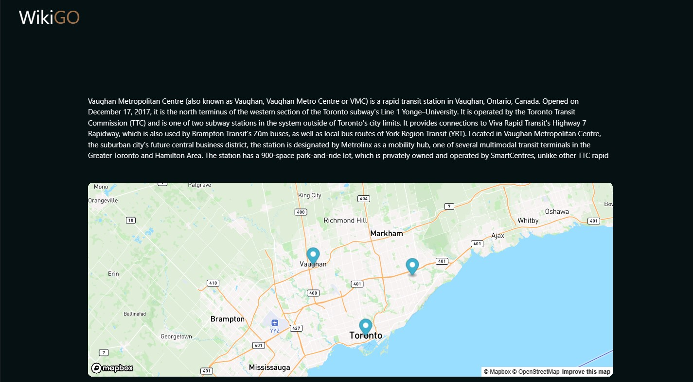

# WikiGO

## Description

WikiGO is a JavaScript based web application that combines [MediaWiki](https://www.mediawiki.org/wiki/MediaWiki) and [Mapbox](https://www.mapbox.com/) API's. Together, a travel website is created that provides users with relevant information based on the city that is searched. WikiGO offers curious users a way to learn more about the history of a destination whilst being able to see exactly where it is on the interactive map below.

## Deployed Application
https://jjocelynn.github.io/WikiGo/

## Table of Contents

- [Usage](#usage)
- [Credits](#credits)
- [License](#license)

## Usage

On page load, users are met with the WikiGO landing page. It features a clickable logo on the top left corner, an eye-catching display, and a search bar in the center. 

Once the user enters a location, their search history is saved and will be displayed underneath the search bar. This action initiates an automatic scroll function that brings the user to the main page content where they can view the Wiki article and map.

To use the map, users can click and drag to adjust location positioning and zoom in or out using the mouse's scroll wheel.
Notice, pin-point markers are associated with each location saved in the search history. However, when the user presses the Clear History button, previous history,and pin-points are wiped. 

## Credits

Map pin-point example: https://codepen.io/Maximusssssu/pen/zYpZYZX?editors=1111

MediaWiki API: https://www.mediawiki.org/wiki/API:Main_page

Mapbox API: https://docs.mapbox.com/

Materialize framework: https://materializecss.com/

## License

MIT License

Copyright (c) 2023

Permission is hereby granted, free of charge, to any person obtaining a copy
of this software and associated documentation files (the "Software"), to deal
in the Software without restriction, including without limitation the rights
to use, copy, modify, merge, publish, distribute, sublicense, and/or sell
copies of the Software, and to permit persons to whom the Software is
furnished to do so, subject to the following conditions:

The above copyright notice and this permission notice shall be included in all
copies or substantial portions of the Software.

THE SOFTWARE IS PROVIDED "AS IS", WITHOUT WARRANTY OF ANY KIND, EXPRESS OR
IMPLIED, INCLUDING BUT NOT LIMITED TO THE WARRANTIES OF MERCHANTABILITY,
FITNESS FOR A PARTICULAR PURPOSE AND NONINFRINGEMENT. IN NO EVENT SHALL THE
AUTHORS OR COPYRIGHT HOLDERS BE LIABLE FOR ANY CLAIM, DAMAGES OR OTHER
LIABILITY, WHETHER IN AN ACTION OF CONTRACT, TORT OR OTHERWISE, ARISING FROM,
OUT OF OR IN CONNECTION WITH THE SOFTWARE OR THE USE OR OTHER DEALINGS IN THE
SOFTWARE.

---

## Badges

## Features

This website is a mapping application that allows users to search for locations, view them on a map, and save their search history for future reference. Some specific features include:

- Search functionality: Users can search for a location using a text input and either clicking the search button or hitting the "Enter" key.

- Map display: The search results are displayed on a Mapbox map, with the location marked by a pinpoint marker. The map also adjusts its size to fit the bounds of the search area and saves the pinpoints of previous searches.

- Search history: The website keeps a record of the user's search history, which is stored in local storage and can be displayed as a list of buttons.

- Clearing search history: Users can clear their entire search history by clicking the "clear history" button.

- Scroll to article: The website also has a function that scrolls the page to the Wikipedia article associated with the location.

- Hover: Users can hover over clickable areas and the opacity/color will change, intuitively letting them know it is functional

- Article scroll: If the wiki article exceeds the text box size, users can scroll to read more.

